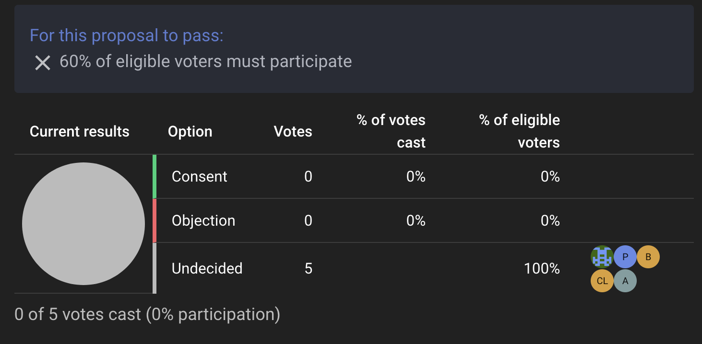
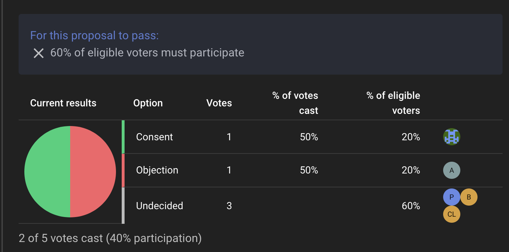
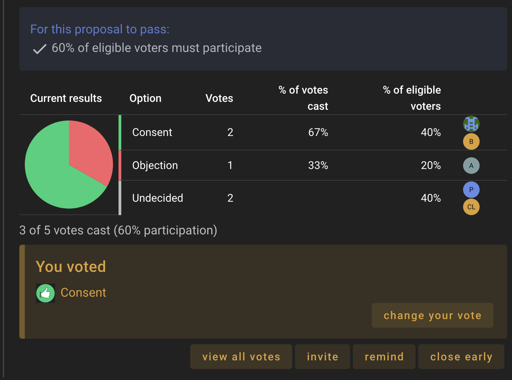

#  Quorum

When drafting a new decision, you have the option to set a quorum, or the minimum percentage of participants required for the decision to be valid.   This feature allows you to fine-tune Loomio's decision-making tools to your own governance process.

The quorum setting is found at the very bottom of a proposal's customisation screen.  You set the quorum as a percentage of the total eligible voters, or leave it blank if a quorum is not required.

You can also set a quorum percentage when making a proposal template, so that certain proposal types always require a quorum (see [Poll Templates](/user_manual/polls/poll_templates/index.html)).

## Example Scenario

The Okefenokee council is an activist organisation comitted to preserving and celebrating their local wetlands, currently sitting at five members.  They have an ongoing thread in Loomio titled "We need more gathering spaces in our park", in which the idea of building a gazebo surfaced. This idea is gaining support and excitement; it seems time to make a decision.

Zach, a member of the council, clicks on the 'Decisions' tab of the thread, and selects the "Consent" proposal template.  The window expands with all the options for this proposal.

He titles the proposal "Let's Build a Gazebo" and keeps the default options of "Consent" or "Objection".

Okefenokee's governance process states that significant decisions require a quorum of 60%.  This proposal feels like a significant decision, so Zach scrolls to the bottom, inputs "60" into the quorum field, and clicks "Start Proposal".

A pie chart appears in the thread showing the vote distribution, with a banner above highlighting the quorum requirements. 

Councilmembers Zach and Albert cast their votes, consenting and objecting respectively.  The pie chart updates, but the banner still has an X next to the quorum requirements as only 40% eligible voters have participated.

Councilmember Beauregard casts a consenting vote.  The banner updates to show a check mark, indicating a quorum has been reached.  Zach can now close the vote early, or wait for the rest of the council to cast their votes.

